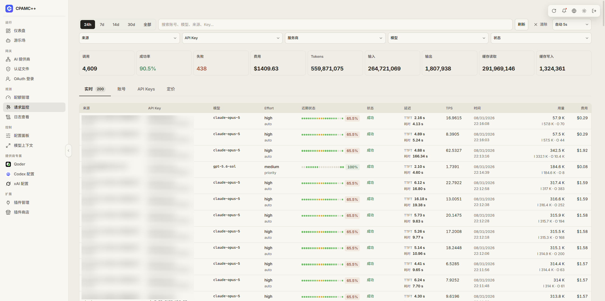
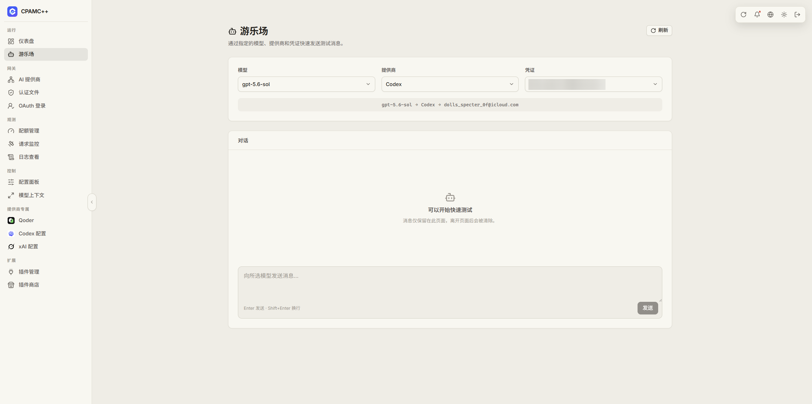

# CLI Proxy API

A practical multi-provider proxy for running shared AI accounts, API keys, and OAuth credentials behind one OpenAI-compatible API.

This is a fork of the original [router-for-me/CLIProxyAPI](https://github.com/router-for-me/CLIProxyAPI), with a focus on account-pool management, Codex routing, monitoring, and day-to-day operations.

## What this fork adds

- **Adaptive Codex routing** that considers account availability, weekly quota, renewal time, reset credits, priority, weight, and per-account concurrency.
- **Safer busy-account handling** so high-concurrency workloads spread across accounts instead of repeatedly hammering one account with 429s.
- **Codex private instructions** with model markers, provider filtering, API-key support, and a dedicated management workflow.
- **Free-first routing for shared models**, with an opt-in preference when free accounts are available.
- **Better Codex recovery** for cooldowns, exhausted accounts, expired or deactivated auth, reset credits, and overloaded streaming responses.
- **Durable usage monitoring** with request history, account status, API-key spending, token details, prices, and model-routing information.
- **Qoder support** for both international and Qoder CN login flows, models, quota, regions, and failure policies.
- **Per-key routing controls** including priority and weighted round-robin behavior for OpenAI-compatible accounts.
- **Custom model controls** including context-window and reasoning metadata overrides.
- **Fork-friendly Docker packaging** with a single `/data` volume and release images published to GHCR.
- **And many more** small fixes, compatibility improvements, provider integrations, and operational conveniences.

## Screenshots

The companion Management Center contains the UI for these features:







## Use it with the Management Center

- **Management UI:** [CLI Proxy API Management Center](https://github.com/josephcy95/Cli-Proxy-API-Management-Center)
- **This API:** [josephcy95/CLIProxyAPI](https://github.com/josephcy95/CLIProxyAPI)

The API can serve the bundled management page, or you can run the Management Center separately while pointing it at your server.

## Quick start with Docker

```bash
docker run -d \
  --name cli-proxy-api \
  -p 8317:8317 \
  -v "$(pwd)/data:/data" \
  ghcr.io/josephcy95/cli-proxy-api:latest
```

The management page is available at:

```text
http://localhost:8317/management.html
```

For a normal local installation, build the server with Go and start it with your own `config.yaml`. The example configuration in this repository is the best place to begin.

## License and community

This project keeps the upstream license and attribution. For discussion, feedback, and updates, visit the [LINUX DO](https://linux.do/) community.
